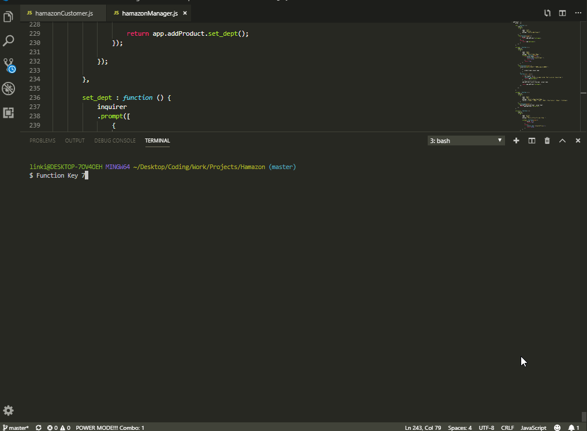

# Hamazon
Amazon-inspired and Ham themed commandline interface storefront app built with node MySQL. The customer application allows for purchasing of items. The manager application deals with managing and adding products.



Installation:
```
npm install
```

then, to run:
```
node hamazonCustomer.js
```
or
```
node hamazonManager.js
```

Hamazon Customer allows you to:
- display list items
- purchase an item & quantity

Hamazon Manager allows you to:
- display list items
- display low quantity list items
- add stock to any product
- add a new product to the list

## Technologies:
- Node.js
- MySQL
- JavaScript
- Inquirer.js